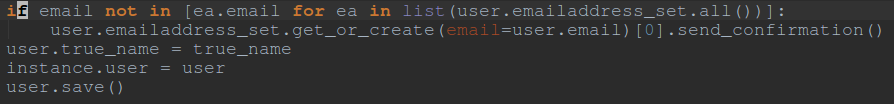
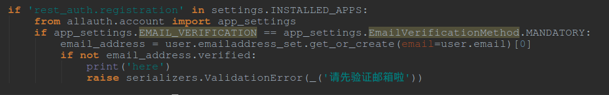

# Day 1

### 今天做了:

- 修复了 rest_auth的rest模块:

    - 在users.adapters文件中的```AccountAdapter```类中重新定义```save_user```函数:
``` python
    def save_user(self, request, user, form, commit=True):
     	super(AccountAdapter, self).save_user(request, user, form, commit)
        data = form.cleaned_data  
        user_type = data.get('user_data')
        true_name = data.get('true_name')
        if user_type:
            user_field(user, 'user_type', user_type)
        if true_name:
            user_field(user, 'true_name', true_name)
        if commit:
            user.save()
        return user
```
- 另外, 在```patients.models``` 和 ```physicians.models```中修改了信号的接受时间,从确认邮箱创建新用户改为注册成功后创建新用户.


###今天遇到的坑:

- 在上面提到的用信号来创建新的病人或医生的时候,会遇到一个坑:
	
	- ```patient_number```会重复, 解决办法: 
	添加hard-code: ```
	Patient.objects.create(user=user, patient_number=str(int(patient_number()) + 1))
	```


###接下来要做:

- 将Patients和Physicians模块完全REST化


---

#Day 2 

###今天做了:

- 理清了rest framework的运作逻辑


###今天踩到的坑:

- 在用logout的时候,可以选择设置**ACCOUNT_LOGOUT_ON_GET= True**或者**False**来决定是否用GET方法来登出.

- 若选择False, 那么在POST的时候需要用登录时生成的key来上传数据.

- 用lookup_field 来改变查询的标志,可以不用pk来定位,而用physician_number

###小总结:

- 不用viewset,因为不够explicity


---

#Day 3 

###今天要做:

- 重构API结构

- 

###今天发现的坑:

- 首先,先[仔细阅读这篇博客](https://medium.com/django-rest-framework/dealing-with-unique-constraints-in-nested-serializers-dade33b831d9#.v8rp9hf9e)

- 解决了在更新api时uniquevalidator报错的情况.

###明天要做:

- 首先还是要重构api:

    - 不同的地方需要不同的serializer:
        - 比如, 在Physician URL 下的PatientSerializer和在Patient URL下的PatientSerializer是不一样的.
        
        
        
        
---

#Day 4

###今天做了:

- patients和Phyasician的api模块重构完成

- 解决了使用api登录时由于新加了或者修改了email条件下的无法登录的问题:
    - 通过重新发送验证邮件的方法:
         
         
     - 由于在登录的Serializer中有和Email相关的模块:
       
       
       
---

#Day 5

###今天要做:

- 将搜索模块API化

###今天做了:

- 用drf-haystack库把搜索模块结构重组了,并且将其部分化

- 成功搭建本地pip服务器

