#Day 1

###今天做了:

- (jia zhuang)设计了Contact

- 没了

---

#Day 2

###今天要做:

 - 继续设计Contact表和逻辑
 
### 今天做了:

- 惭愧惭愧,只把Contact和Physician表在UserPatientForms表中完善了

- 原因:

     - 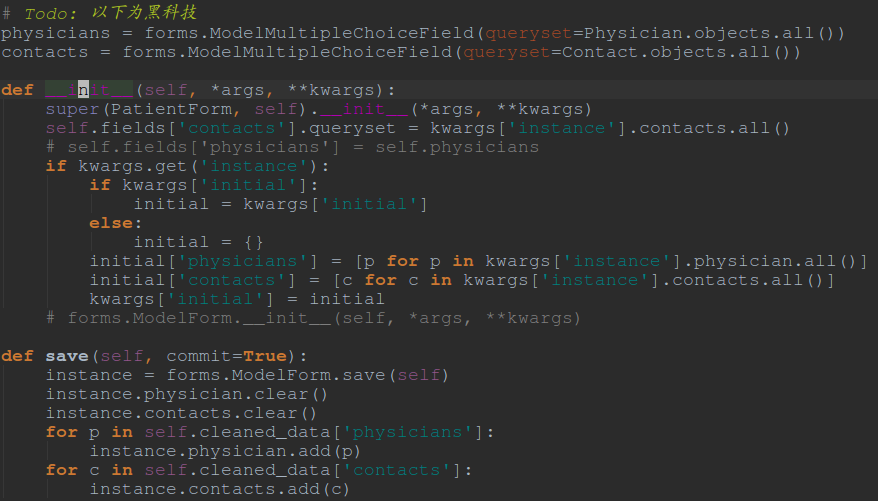
     
     - 并非黑科技,要注意以下几点:
     
         1 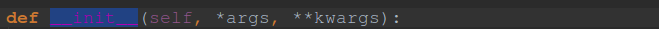
       	 	- **不要把__init__写成了__int__!!!!!!**
         2. 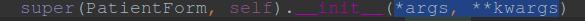
         	- 此处继承的时候参数只有args, kwargs, 不要添加self, 否则会出现多传参数的现象.
         3. 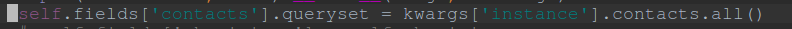
         	- 此行作用为再次筛选显示的查询结果
         4. 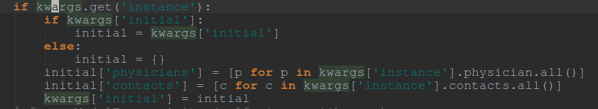
		- 这是**非常重要**的一段代码! 
		- 作用是在GET的时候显示的初始instance数据

###参见[这里](http://chase-seibert.github.io/blog/2010/05/20/django-manytomanyfield-on-modelform-as-checkbox-widget.html), [这里](http://stackoverflow.com/questions/2216974/django-modelform-for-many-to-many-fields), [还有这里](http://stackoverflow.com/questions/28141576/form-create-and-update-view-for-many-to-many-relationship)
 

---

#Day 3

###今天做了:

- 简单做了病人就诊类型的model,并没有做完

###今天思考了:

- 关于api设计的一些问题

---

#Day 4

###今天做了:

- 首先,了解了RESTful-API设计的最佳实践:

    - 参见 [这里](http://www.ruanyifeng.com/blog/2014/05/restful_api.html), [这里](http://blog.jobbole.com/41233/), 还有[这里](https://www.oschina.net/translate/best-practices-for-a-pragmatic-restful-api)
    
    - 另外,有时间可以参考大厂的api设计思路,比如[github](https://api.github.com/)的.

- 其次呢,决定在api的uri里使用Multiple parameters的思路, 参见[这里](http://stackoverflow.com/questions/15754122/url-parameters-and-logic-in-django-class-based-views-templateview)还有[这里](http://stackoverflow.com/questions/11494483/django-class-based-view-how-do-i-pass-additional-parameters-to-the-as-view-meth)

- 对于query paramers的过滤:

    - 官方的链接在[这里](http://www.django-rest-framework.org/api-guide/filtering/#filtering-against-query-parameters)
    
    - 其他的方法见[这里](http://stackoverflow.com/questions/150505/capturing-url-parameters-in-request-get), [这里](http://stackoverflow.com/questions/11280948/best-way-to-get-query-string-from-a-url-in-python)
    
    - 一个第三方库[django-url-filter](https://github.com/miki725/django-url-filter)可以参考使用

- 将type-of-visit定义为和病人的一对一的数据库类型
    - 在api化的时候,不用list,直接使用detailview化,将get_object()函数覆盖,这样就可以不用pk值来确定一个type了:
    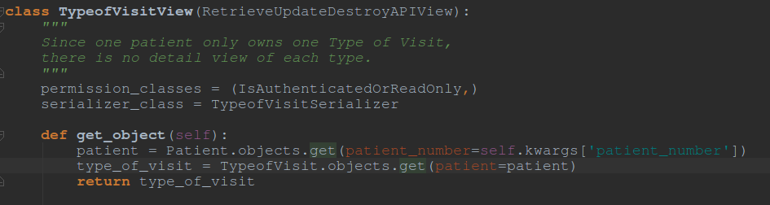
    
    - **修正!**
    
        - 为了实现获取或创建功能,将代码改造如下:
        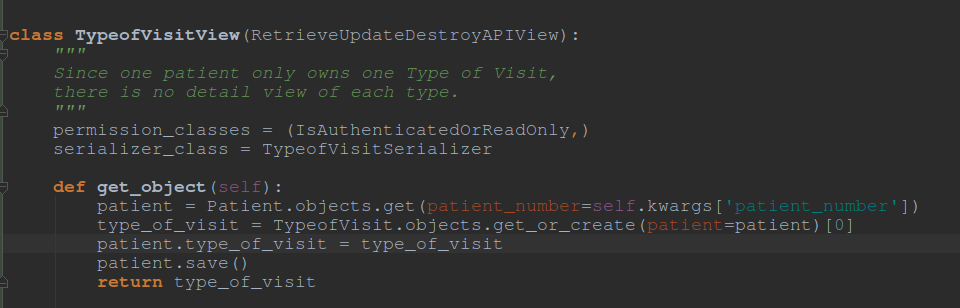
        更加完整了:)
        
###明天要做:

- 病史 T____T

- TOT  vs  CRY

---

#Day 5

### 今天做了:

- 首先解决了昨天没完成的坑:

    - 使用Group Choices 解决就诊类型的分组:
    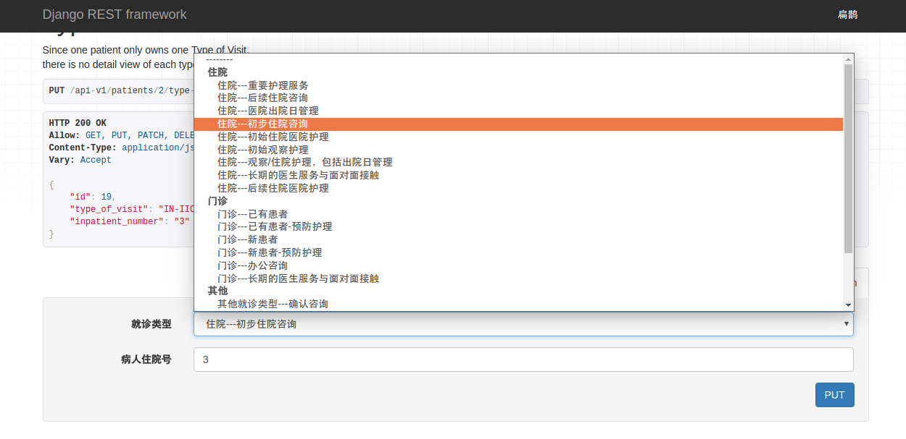
    这样就可以只用选择一种类型了.
    代码如下:
    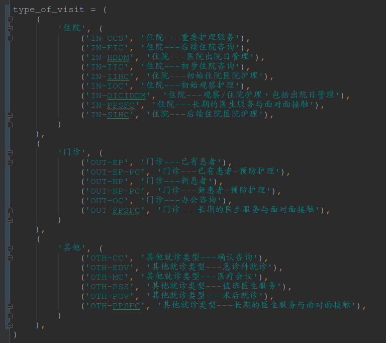
    
    - 解决住院病人号的相关问题:
    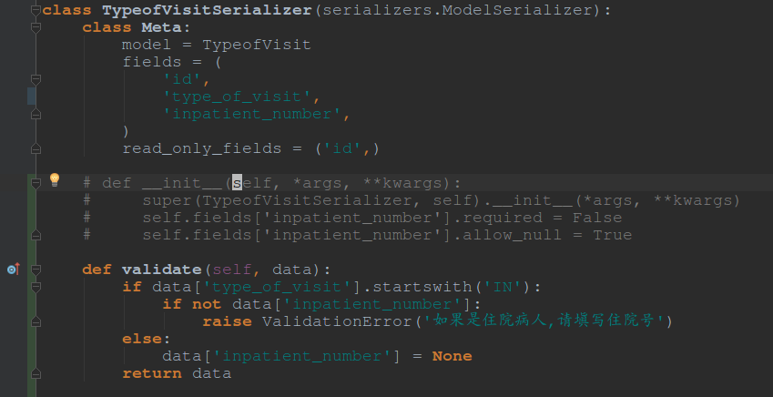
    
    	使用validate函数可以轻松解决很多与**填写的数据定制化**相关的问题!
    
    	另外, 在ModelSerializer下的序列化类中,对于隐式声明的fields的参数,可以用如下方式定义:
    	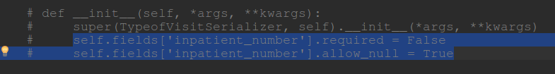

- 其次开始定义病史的数据库表,详细逻辑参见数据库代码.

    - 做到了cardiovascular一行.
    	