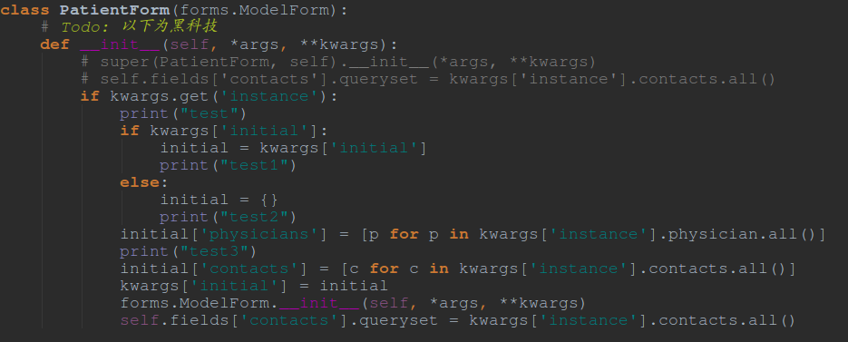
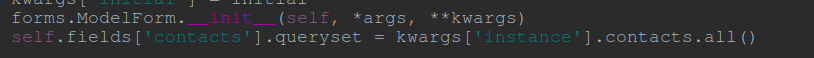
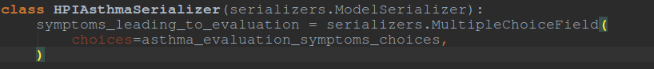
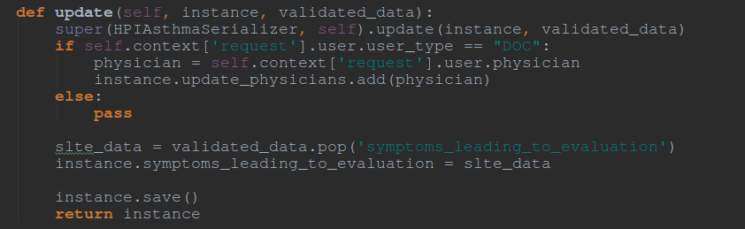
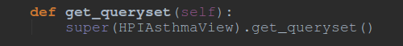

#Day 1

###决定:

- /patients/2/cc需不需要update操作.

###今天解决了:

- 

	这样才完全解决了PatientForms遇到的问题关键在于:
	
	顺序是这样的
	
- 为了解决MultiSelectField的问题,需要explicitly地写出这个:
	
	同时,update方法里也要显式地写出来:
	

- 由于会遇到重载get_queryset方法的情况,如果没有什么好重写的(由于写了get_object方法), 可以这样:

