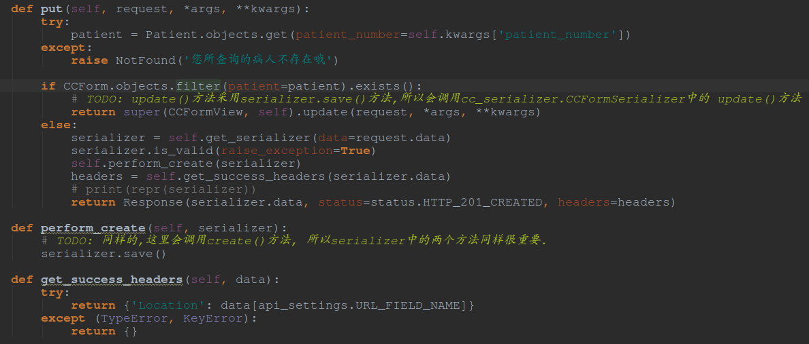
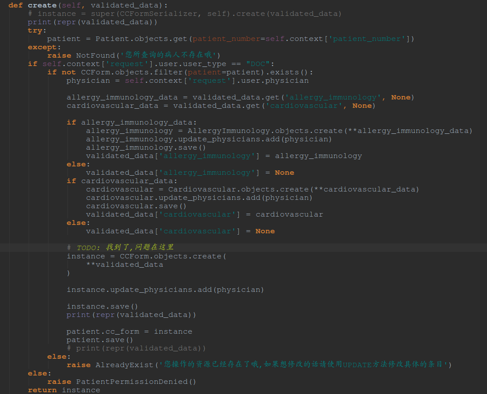
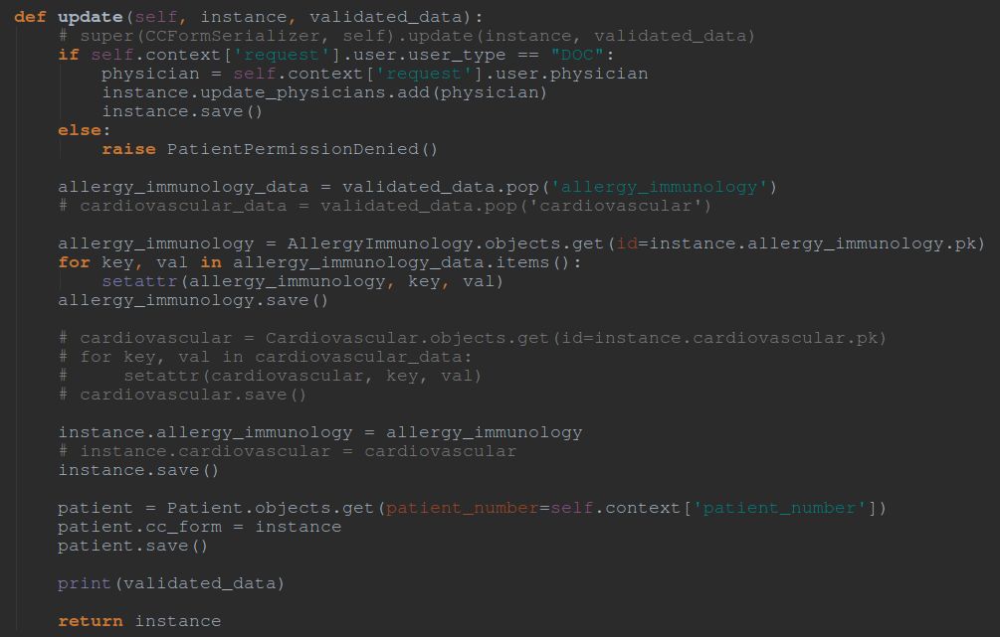

#Day 1

###今天做了什么:

- 首先, 停止了无谓的数据库复制

- 其次开始完善api的构建

---
#Day2-Day3

###今天做了什么:

- 继续完善api代码

- 数据库设计时一定要考虑清楚on_delete的使用方法,当使用one_to_one关系时,切记要使用on_delete=models.SET_NULL. 参考[这里](http://stackoverflow.com/questions/38388423/what-does-on-delete-does-on-django-models)和[这里](http://stackoverflow.com/questions/24575555/django-one-to-one-dont-want-delete-related-model)

- 决定不使用POST方法,只使用PUT方法,通过在View中判断是否存在想要编辑的instance来做到:

    - 在这个过程中, 对数据库的详细操作还是在serializer中进行的:
    	- 如果是生成新的对象,则通过serializer类中的post(self, validated_data)方法生成
    	
    	- 如果是要更新已经存在的对象,则通过update(self, instance, validated_data)来更新
    	

###今天想了什么:

- 可以对类型相同的病的model的serializer写一组功能类似的create, update, delete等方法.

- 

----

#Day 4

###今天做了什么:

- 完善了对cc API的操作,使得可以在/patient/{patient_number}/cc/中直接更新和生成ccForm以及其下一层的数据

- hpi相同

- 没明白django中的update()函数有啥用处.

###准备做什么

- Search的自动补全研究

- 发现一个行的第三方库:django_autocomplete_light

----

#Day 5

###今天做了什么

- 简单完成了suggestion的工作:

	- 用简单的Charfield来实现实时搜索, 而不是使用Haystack的AutoComplete功能
	
	- 因为不知道autocomplete的具体实现原理

