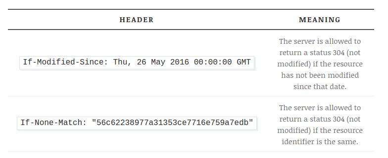
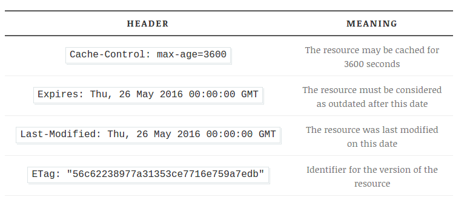

#HTTP Cache in Nginx

##Client Side

Browser automatically generates headers based on the already cached resource. These headers aim to check if the cached sources is still fresh. There are two ways of doing that:

- Check if the resource has been modified since it was cached.
- Check if the identifier of the resource (a digest) has changed.

Based on the response of server, the browser will choose to use the cached version or will make a request to download the resource.

##Server Side

Server can define the cache policy with the `Cache-Control` headear.

Specific instruction is in book <图解http>.

##Configure cache in Nginx

If we want to cache all resources in `/static/`folder:

- `/static/js/`
- `/static/css/`
- `/static/img/`

Create an Nginx configure file: `/conf/cache.conf` to hold all cache related configurations. In the main `nginx.conf` file, add :

	server {
	# ...
	include conf/cache.conf;
	}
	
The `cache.conf` should be like this:

	# JS
	location ~* ^/static/js/$ {
    	# Indicate that the resource may be 
    	# cached by public caches like web caches for instance, if set to 'private' 
    	# the resource may only be cached by client's browser.
    	add_header Cache-Control public;

    	expires     24h; # Indicate that the resource can be cached for 24 hours
	}

	# CSS
	location ~* ^/static/css/$ {
    	add_header Cache-Control public;

    	#Equivalent to above:
    	expires     86400; # Indicate that the resource can be cached for 86400 seconds (24 hours)

    	etag on; # Add an ETag header with an identifier that can be stored by the client
	}

	# Images
	location ~* ^/static/images/$ {
    	add_header Cache-Control must-revalidate; # Indicate that the resource 	must be revalidated at each access

    	etag on;
	}

No need to add `last-modified` header in nginx since it will add it automaticaly

## Use Nginx as Cache Server

###**`proxy_cache_path`**:

The path where nginx will store cached content and the memory size.

- `path` defines the cached content path, something like `data/nginx/cache`.
- `keys_zone` allows you to define the zone where the keys leading to these contents will be stored, name it as you wish and define the size you need (we speak of the keys, according to documentation, 1MB is about 8000 keys).
- `inactive`: the time duration for an unused resource stay in cache(defualt: 10 min).

###**`proxy_cache`**
This directive stands in a `location` block and allows you to link it with the `keys_zone` of your choice (references the `keys_zone` parameter of the `proxy_cache_path` directive).
A simple working example where we also added a header to all of our requests called `Web-Cache-Status` that will be set by nginx to `Hit` if the content comes from the cache or `Miss` if it doesnt:

	proxy_cache_path /data/nginx/cache keys_zone=my_zone:10m inactive=60m;

	server {
    	listen 80 default_server;
    	root /var/www/;
    	index index.html index.htm;

    	server_name example.com www.example.com;

    	charset utf-8;

    	location / {
        	proxy_cache my_zone;
        	add_header Web-Cache-Status $upstream_cache_status;

        	include proxy_params;
        	proxy_pass urlOfProxiedServer
    	}
	}

### Advanced directives

Set **`proxy_cache_revalidate: on`** in `server` section to revalidate stale contents whenever it  find stale contents before trying to download it.

Set **`proxy_cache_lock: on`** in `location` section to tell nginx to download the content only once and just wait for the content to be downloaded into the cache.

Set **`proxy_cache_bypass`** in `location` to let you set the conditions in which the content will not be taken from the web cache.

Set **`proxy_no_cache`** to let you set the conditions in which the content will not be stored to to web cache.

	location / {
		# go straight to the fresh content for requests showing 
		# a no cache cookie or argument in the source server instead of web cache.
		proxy_cache_bypass $cookie_nocache $arg_nocache;
		
		# prevent Nginx from storing the content in the response.
		proxy_no_cache $cookie_nocache $arg_nocache;
	}

Set **`proxy_cache_use_stale`** to allow nginx to show stale content in case it gets a `timeout` or a `5XX` error from server.
	
	location / {
		proxy_cache_use_stale error timeout updating http_500 http_502 htttp_503 http_504;
	}