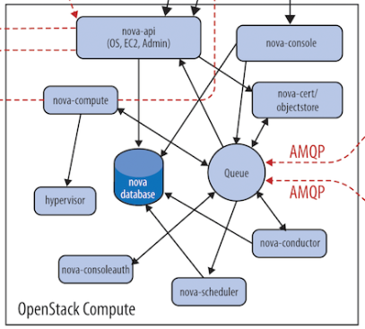

# openstack学习之NOVA 一

**NOVA**是整个`Openstack`的核心，也是最复杂的。

### NOVA的架构图

`nova`包含了很多组件，这些组件以子服务（子服务其实就是后台的deamon进程），可以分为以下几类：

1. **API**
    
    - **nova-api**
    接收并响应客户端的API调用
    *注意：*除了提供OpenStack自己的API，nova-api还支持Amazon EC2 API。

2. **Compute Core**

    - **nova-scheduler**
    由名字就知道，这是虚拟机调度服务，负责决定在那个计算节点上运行虚拟机。
   - **nova-compute**
    管理虚拟机的核心服务，通过调用Hypervisor API实现虚拟机生命周期管理。
   - **Hypervisor**
    计算节点上跑的虚拟化管理程序，虚拟机管理最底层的程序。
    不同虚拟化技术提供自己的Hypervisor。
    常用的Hypervisor有KVM, Xen, VMWare等。
  - **nova-conductor**
       nova-compute经常需要更新数据库，比如更新虚拟机的状态。
    出于安全性和伸缩性的考虑，nova-compute并不会直接访问数据库，而是将这个任务委托给conductor。
    
3. **Console Interface**

    - **nova-console**
    