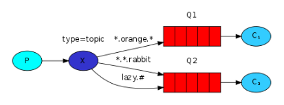

# RabbitMQ 学习 2

多队列

### Exchanges

`生产者`将消息直接发送到`Exchange`，`Exchange`将消息发送给`Queues`

#### Exchange Type

`Exchange`根据`Exchange Type`来决定将消息发送给`queue`的规则和方式。

- 一共有`4`种`Exchange Type`：

	- `direct`：只向`routing_key`（`message`的属性）等于`binding_key`（`queue`的属性，或者说时`queue_bind`的属性）相等的`queue`发送消息。
	- `topic`：不好描述，看图体会：
	
	（`*`表示任意一个词，`#`表示任意多个词。`topic`类型exchange既可以表示`direct`也可以表示`fanout`）
	- `headers`
	- `fanout`: 向所有绑定的`queue`发送消息，忽略`queue`上的`routing_key`参数。

**默认Exchange**： 在生产者`publisher`一条消息的时候，如果参数`exchange`被设置为空字符串时，消息直接传送给名为`routing_key`的`queue`。

#### 临时队列

在`queue_declare`的时候不指定`queue=`参数可以创建临时队列（不是用户自己命名，而是Rabbit自己取一个随机的名字），可以在`queue_declare`的时候指定一个`exclusive=True`参数在`Consumer`关闭链接的时候自动删除这些`queue`。

#### 绑定

队列和`Exchange`之间的绑定关系称为`绑定（bindings）`。用queue_bind()来声明。

使用`queue_bind`的时候，会指定`queue`和`Exchange`，以及他们之间的`routing_key`。

想要声明多条`routing_key`的话，可以使用多个`queue_bind`语句。

