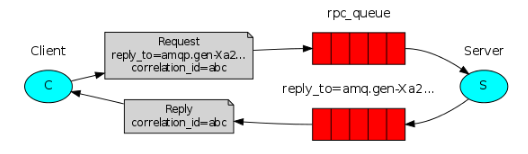

# RabbitMQ 学习 3

RPC

**注意**

RPC使用规范：

- 确保在调用函数时明确知道该调用时本地调用还是`RPC`调用
- 调用的依赖需要显示表明
- 文档清晰
- 异常处理
- 对`RPC`的超时处理

### 回调队列

用`RabbitMQ`进行`RPC`调用相对来说是比较容易的：

- 客户端向`RabbitMQ`发送请求消息，`RabbitMQ`向其返回计算后的消息。
- 为了能够接收响应消息，客户端需要在发送时附上一个回调队列的地址。

		result = channel.queue_declare(exclusive=True)
		callback_queue = result.method.queue

		channel.basic_publish(exchange='',
                      		routing_key='rpc_queue',
                      		properties=pika.BasicProperties(
                            		reply_to = callback_queue,
                            ),
                      		body=request)

### 消息属性

- `delivery_mode`: `2`表示消息持久化，其他任意值表示非持久化
- `content_type`: 消息的编码类型，可以选择如：`application/json`。
- `reply_to`: 最主要用于声明一个回调队列
- `correlation_id`: 将请求和`RPC`响应相关联

### Correlation_id

在使用`RPC`的时候，如果将所有的`RPC`请求都发送给同一个回调队列，会很没有效率。

一个解决办法是：

- 给每个客户端都分配一个回调队列
- 在这个回调队列中给每个消息分配一个`Correlation_id`用以将请求和响应相关联。

### 概念

`RPC`实现的基本思路是：

`Server`端和`Client`端都同时是`Publisher`和`Consumer`。

#### Server端

- 一个`Consumer`作为`RPC`的`server`，该`Consumer`从绑定的`queue`中接收需要运行的上下文，进行运算。

- 运算结束后，该`server`扮演`Publisher`的角色，将运算结果发布到`reply_to`指定的队列里（这里假设使用默认`Exchange`），并且指定`Correlation_id`。

#### Client端

 - 每个`Client`端独享一个回调队列
 
 - 一直扮演着`Consumer`的角色，从这个回调队列中读取返回的运算结果
 
 - 每次调用`RPC`函数时就扮演`Publisher`的角色，将计算需要的上下文发送给`server`（通过另一个队列，并不是上面的回调队列），并且在发布者指明`reply_to`等于刚才声明的回调队列，并且指明一个唯一的`Correlation_id`。

### 总结

这种方式实现的`RPC`具有以下特点：

- 易扩展：
	
	- 多跑一个`server.py`就可以扩展`server`一倍的处理能力，相当于在`rpc_queue`队列上多订阅了一个`Consumer`。
	
