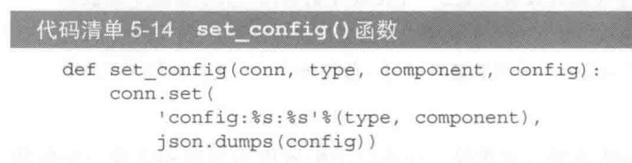

# Redis学习17

Redis的更多用途

### 作为统计工具

可以把`Redis`当做各种数据的统计工具：

  - 页面访问时间
  - 页面访问次数
   -  IP查询
  - 。。。
  
### 作为配置信息的存储工具

在分布式应用中，用`Redis`来存储配置信息可以很好地避免由于配置信息更改带来的问题。

1. 用中间层来获取Redis中相应的值

2. 为每个应用组件分别配置一个Redis服务器（或者同一台服务器不同数据库）
    - 专门负责日志
    - 专门负责统计
    - 专门负责进行缓存
    - 专门负责cookie、session

3. 把一个Redis服务器作为所有Redis服务器的配置信息存储中心
	

